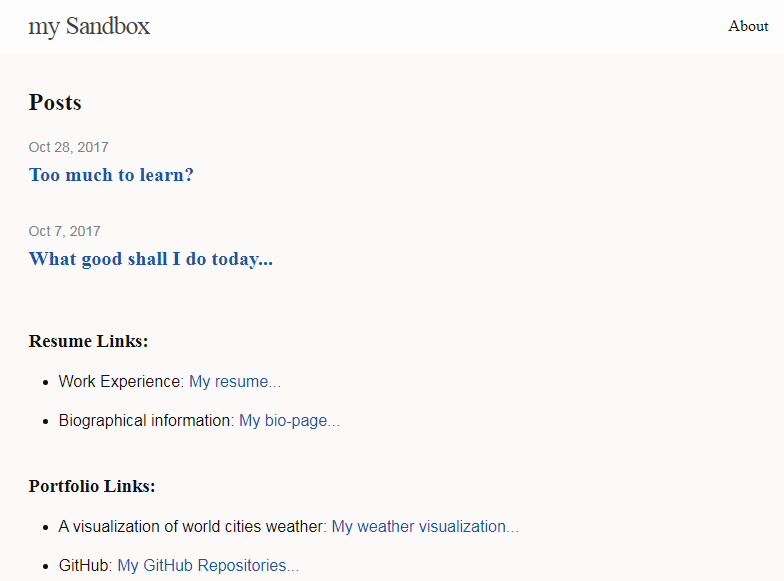

# chrisg4github.github.io

Codecademy class - Deploy a Website 07/13/2017  

- http://chrisg.rocks
- Site is generated using Jekyll (jekyll is written in ruby), and it is a blog aware site which means it is set up for any number of posts to be displayed on the site.

#### Technologies

- HTML, CSS, Sass pre-processor (Syntactically Awesome Style Sheets), Liquid template language (written in Ruby).  

